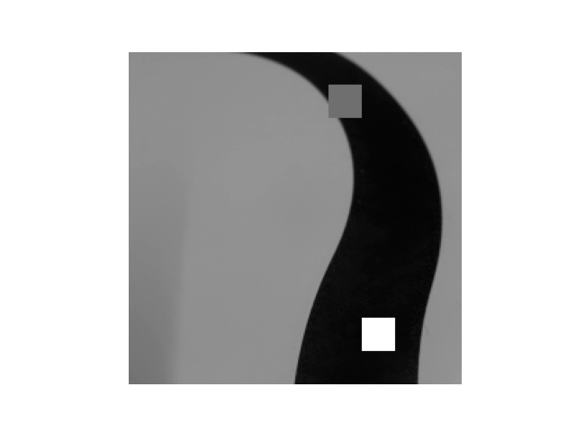

## 巡线要求

 对应不同的轨迹输出不同的轨迹点，以下是需求示意，实际不是俯视图：

### 平滑路线

### 急转弯

​                                                                   

### 丁字路口

### 十字路口

    
    

### 虚线

在识别预测到车道特征点后，返回给应用层对应的坐标点数据和地图类型

### 点返回速度

​        以上是一个实际摄像头巡线,fps最大约在14左右

## 使用的硬件

摄像头：SC3336 3MP Camera (A)，300万像素，最大支持30fps

主控芯片:rv1106   cpu Cortex A7 1.2GHz ,NPU 0.5TOPS,ISP 4M30FPS

实测下来:摄像头只能跑25fps

LCD:st7789 240x240

## 巡线方案

### opencv巡线

​       opencv-mobile 已支持 luckfox-pico MIPI CSI 摄像头和 rk-aiq/rga 硬件加速

​        opencv-mobile：最小化的 OpenCV 库。这是一个比官方版本小 10 多倍的 OpenCV 库，它对模块进行了删减，仅保留了最基本的运算模块和常见的[图像处理](https://cloud.tencent.com/product/tiia?from_column=20065&from=20065)功能，适用于Android、iOS、Windows、Linux、macOS 等平台。

​         opencv-mobile是用C++编程，在unbantu上交叉编译后放到rv1106上运行

​          应用程序大小：	4M

####    巡线思路

   1.将图片转换灰度图，然后转换为二值图

    
    

  2.对二值图进行开操作

​        腐蚀和膨胀，它主要用于去除小型噪声并保持对象的形状和大小不变。开操作可以平滑对象的边界，并分离彼此接触的对象

    
    
    

  3.寻找车道

​     确定车道起始位置的方式：以横方向做x轴，列数为横坐标，每列黑色像素点的个数作为y坐标，做一个显示分布图，如下图蓝色透明区域。

​    当找到黑色像素点最高的位置的时候，即认定这是车道开始的中心位置

​     然后以这个点为中心，以此向上去画方框去搜索车道，然后就能够识别到车道的形状和走向。

​     更进一步，可以设置一个感兴趣区域ROI，只对ROI区域里面的像素做处理，或者对图像下部中心区域的像素点加权重

​    

 4.对于十字路口，急转弯的识别方法：

​        对于十字路口或者急转弯可以用卷积的方式来寻找，定义一个卷积核，或多个卷积

​       如[-1, -2, -1, 

​             0, 0, 0, 

​             1, 2, 1] 对搜索框里面的图像进行卷积，找到水平方向和垂直方向上的特征。

​              这些特征配合之前搜索到的车道线可以判断出前方是，十字路口，T字路口，左转，右转

**优点**：？？？

**缺点**：  

​       1.由于纯用cpu去计算，示例的CPU占用比较高，opencv-mobile 摄像头输入优化+显示+巡线算法

​          CPU占用率会达到：70%~80%

​       2.帧率 ：8~9 fps

​       3.对于直线和弯道，效果比较可以，但对于直角转弯，在转弯过程中预测点的效果比较差

​       4.抗干扰能力比较差，如果画面中出现了其它元素，如地毯，或者远处的物体，会导致预测出现较大的失误

​       5.很难处理复杂地图

​       6.**很难做到标志识别**

### 神经网络

​    瑞芯微提供了完整的对于各种平台和算法模型的转换为rknn格式的方法 

   rknn是 rk npu使用的深度学习模型，并且提供了两种在rknpu上运行模型的方法

####    1.[RKNN Toolkit Lite2](https://github.com/rockchip-linux/rknn-toolkit2) 

​        RKNN Toolkit Lite2  是Rockchip NPU平台的编程接口(Python)，用于在板端部署RKNN模型。 

​        但 Toolkit-lite2目前适用于Debian10/11（aarch64）系统，且对内存，磁盘要求均较大

####     2.RKNN Model Zoo

​         RKNN Model Zoo基于 RKNPU SDK 工具链开发, 提供了目前主流算法的部署例程. 例程包含导出RKNN模型, 使用 Python API, CAPI 推理 RKNN 模型的流程

​     

####    3.模型效果

工程地址:https://github.com/cdjq/maikun_net

模型大小，转换为rknn后,大小为:1~2M，巡线应用程序800k

​       经过推理后

​     

识别效果准确率还行，不过上面只是测试的训练集，摄像头向下倾的比较厉害，到时候要更改为实际的训练集。

#### 4.原理

   把图片分为10x10的网格，对有点的位置进行标注，然后和图片一起送入神经网络训练，得到10x10xn的标签，处理的到车道上的点

**优点**：

​           1.用NPU去推理，占用的CPU不高，摄像头输入+巡线+显示

​             CPU占用率为：30%~35%

​           2.帧率 ：14-15 fps,单跑模型每28ms处理一张图片

​           3.增大数据集即可使识别效果变得很好

​           4.抗干扰能力强，只要在数据集里面加入这些干扰即可

​           

**缺点**：  

​       1.现在的模型只能巡线，不能对路线上的 交通标志进行识别

​       2.如果任务比较复杂，模型变大，帧率也会随之降低

  

### 对识别物体和巡线的实现方向：

​     1.在rv上可以正常使用yolov5，可以把车道一部分当为一种物品，在yolo上测试实验效果,但yolo的模型较大，帧率会低很多，根据官方的示例，

如果使用yolo5，加上显示，帧率最大只能达到，6~7fps

2.使用上面的模型

​     需要调整框架，更多的训练数据，

​    下面使模型推理结果，难度较大,不同的颜色表示不同的物体

    
    

    

    
    

## 存在问题：

   如果在识别过程中要看到立着的车道标志，那么有可能小车前放靠近车头位置的路线将在摄像头里面消失,   需结合实际情况，但使用测试的摄像头肯定会有大部分前方的车道线消失

